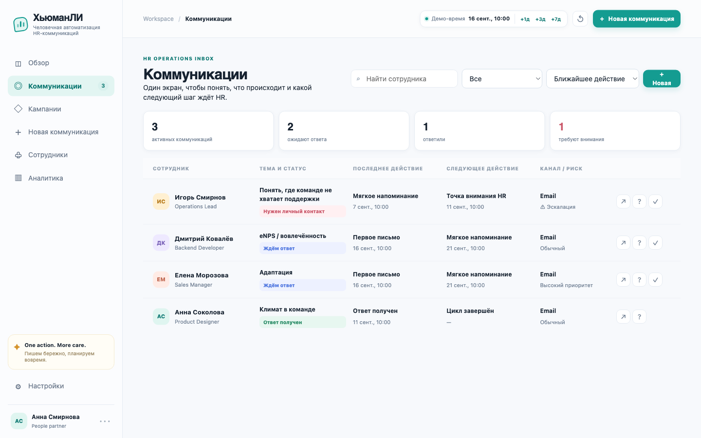
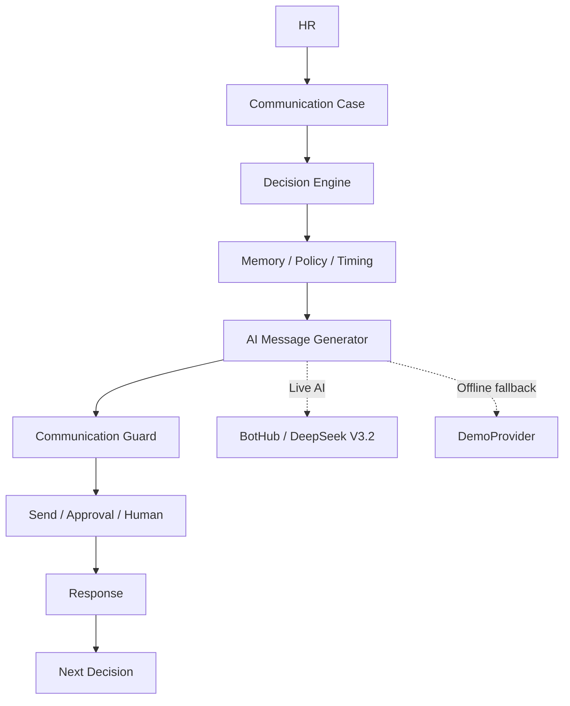
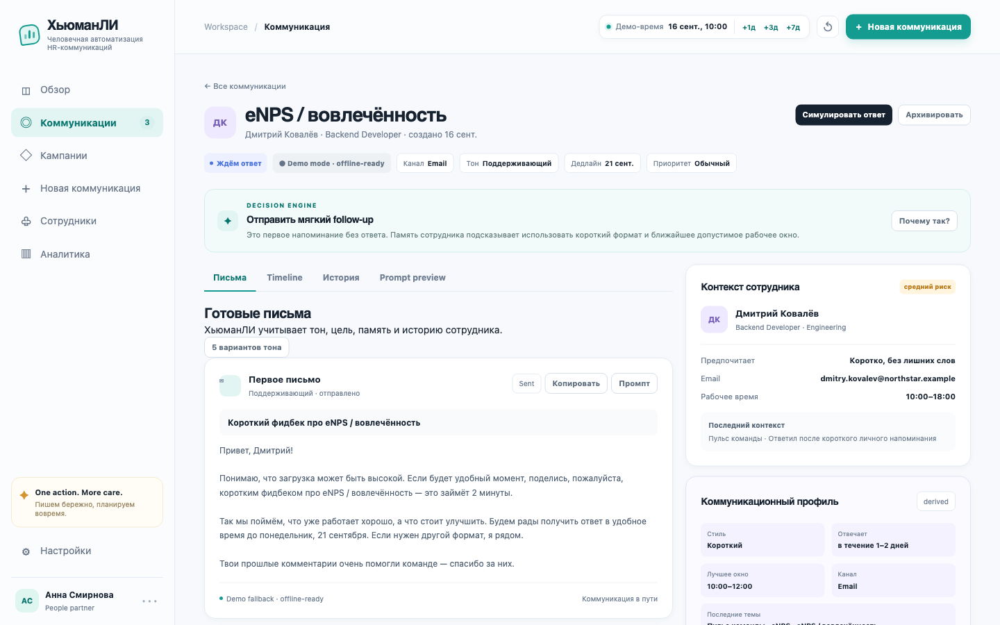
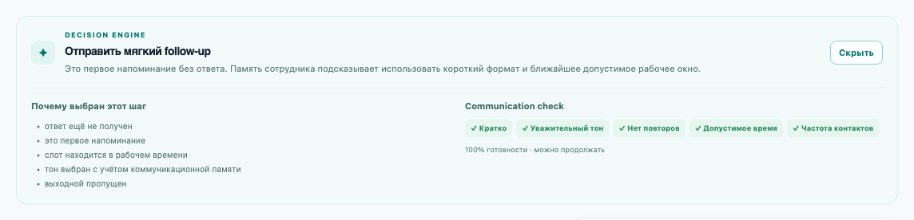
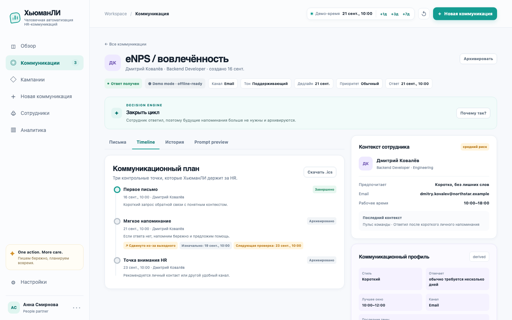
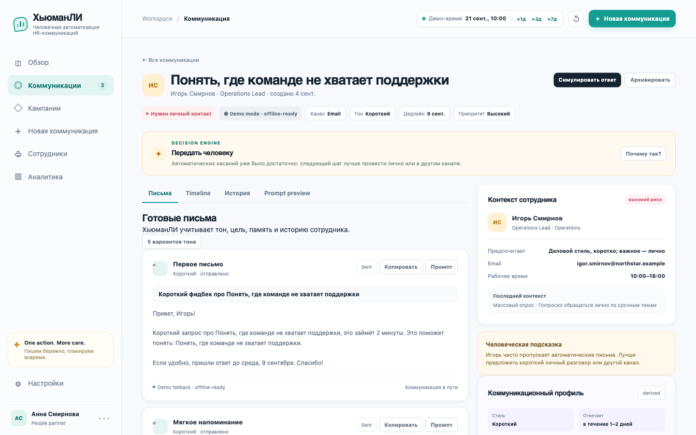
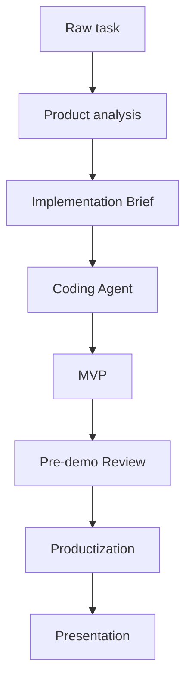

# ХьюманЛИ

**Человечная автоматизация HR-коммуникаций**

> Ассистент полного цикла HR-коммуникаций: знает, кому, когда и как написать — и когда остановиться.

ХьюманЛИ помогает HR вести коммуникацию не как набор разрозненных писем, а как управляемый цикл: запустить запрос, выбрать подходящее время, подготовить персональное сообщение, отправить бережное напоминание, увидеть ответ и вовремя передать разговор человеку.

Это не очередной AI-генератор текста. Decision Engine отвечает за действие, timing и границы автоматизации, Communication Memory даёт контекст предыдущих касаний, а AI используется для естественной формулировки уже принятого решения.

Проект создан как local-first MVP для HR-команд. Внутри есть рабочий inbox, синтетические профили сотрудников, симуляция времени и ответа, offline fallback и прозрачные ограничения demo-режима.



## Что умеет ХьюманЛИ

- **Communication Inbox** — все активные кейсы, статусы, риски и ближайшие действия в одном workspace.
- **Decision Engine** — воспроизводимо выбирает action, timing, тон, приоритет и необходимость эскалации.
- **Персональная генерация сообщений** — учитывает цель запроса, контекст сотрудника и историю коммуникации.
- **Communication Memory** — хранит derived-контекст: привычный формат, время ответа, удачные окна и недавние темы.
- **Quiet hours и weekends** — не планирует сообщения в неуместное время и сдвигает события на рабочее окно.
- **Follow-up orchestration** — готовит следующий шаг, учитывает предыдущие сообщения и не превращает напоминания в бесконечный spam.
- **Communication Guard** — проверяет краткость, тон, повторы, частоту касаний и допустимость отправки.
- **Sensitive topic approval** — компенсация, performance, конфликт и другие чувствительные темы требуют подтверждения HR.
- **Human escalation** — после повторного молчания система рекомендует личный контакт.
- **Live AI + deterministic fallback** — публичная Pages-демо использует BotHub/DeepSeek через Yandex, а DemoProvider сохраняет тот же workflow без сети и ключа.

## Как это работает



Главный принцип: LLM отвечает за язык, а не за скрытые HR-решения. Правила заранее определяют, когда писать, нужен ли follow-up, можно ли отправлять сообщение автоматически и пора ли остановиться.

## Почему такая архитектура

### Deterministic decisions

Decision Engine выбирает действие и объясняет его через reason codes и human explanation. Это делает timing, escalation и sensitive-topic approval воспроизводимыми и проверяемыми.

### Local-first

MVP запускается как статическое приложение и хранит synthetic demo state в браузере. Для проверки главного workflow не нужны сложная инфраструктура, база данных или аккаунты.

### Graceful fallback

Live AI — подключаемый provider, а не критическая runtime-зависимость. При отсутствии ключа, сети, корректного ответа или доступного провайдера включается deterministic DemoProvider.

### Human-in-the-loop

Система знает границы автоматизации: чувствительные темы требуют подтверждения, а повторное отсутствие ответа приводит к рекомендации связаться лично.

## Скриншоты

Интерфейс показывает не только генерацию письма, но и состояние всего коммуникационного цикла.

<p>
  
  
</p>
<p>
  
  
</p>

Дополнительный экран с derived demo-метриками: [Analytics](./presentation/screenshots/06-analytics.png).

## Как создавался ХьюманЛИ

Проект создавался в рамках хакатона по vibe coding при жёстком временном лимите. Важным оказался не сам факт генерации кода, а управляемый процесс:

- задача сначала разбиралась отдельно на продуктовые риски и пользовательский сценарий;
- затем формировался implementation brief с границами MVP;
- coding agent работал по development protocol и сохранял документацию рядом с кодом;
- продукт развивался итерациями: от локального MVP к Inbox, Decision Engine, Memory, Guard, Live AI и productization;
- после MVP проходили pre-demo review, проверка основного flow и подготовка защиты.

В workflow использовались Codex как основной coding agent, отдельный продуктовый анализ, а также ChatGPT для orchestration, prompts и review. Инструменты были полезны именно как части процесса с постановкой, scope control, тестированием и проверкой результата.



Главный вывод: vibe coding работает надёжнее как pipeline с постановкой задачи, документацией, ограничением scope, тестированием и review, а не как команда «сгенерируй приложение».

## Технический стек

- vanilla HTML, CSS и JavaScript без runtime-зависимостей;
- Node.js built-in `http` как минимальный локальный proxy для Live AI;
- BotHub / DeepSeek V3.2 в публичной Pages-демо и OpenRouter / Qwen для локального proxy через структурированный JSON-контракт;
- GitHub Pages + Yandex API Gateway + Yandex Cloud Function для опубликованного Live AI;
- `localStorage` для локального состояния demo;
- Mermaid для архитектурных схем;
- Git для версионирования.

## Запуск

### Offline / Demo

Backend и API key не нужны — используется deterministic DemoProvider.

```bash
git clone https://github.com/SpNkd/hyumanli-hr-assistant.git
cd hyumanli-hr-assistant
open index.html
```

В Windows или Linux можно открыть `index.html` двойным кликом. Для запуска через локальный HTTP-сервер:

```bash
node server.js
```

Затем откройте <http://localhost:4173>. Если `.env` отсутствует, приложение остаётся offline-ready.

### Online demo

Опубликованная демо-версия доступна на [GitHub Pages](https://spnkd.github.io/hyumanli-hr-assistant/). Она не требует ручного запуска backend: статический frontend обращается к Yandex API Gateway, а ключ провайдера остаётся только в environment Yandex Function.

Публичный Live AI-провайдер: BotHub / `deepseek-v4-flash`. Если провайдер временно недоступен, интерфейс переключается на deterministic DemoProvider.

### Live AI

1. Скопируйте пример конфигурации:

   ```bash
   cp .env.example .env
   ```

2. Добавьте ключ OpenRouter только в локальный `.env` и при необходимости измените модель:

   ```dotenv
   OPENROUTER_API_KEY=your_key_here
   OPENROUTER_MODEL=qwen/qwen3-30b-a3b-instruct-2507
   ```

3. Запустите proxy и откройте приложение:

   ```bash
   node server.js
   ```

`.env` игнорируется Git и никогда не нужен frontend-коду. Не вставляйте ключ в HTML, JavaScript, screenshots, README или issue.

## Что посмотреть за 2 минуты

1. Откройте **Коммуникации** и покажите Inbox с ближайшими действиями.
2. Выберите Дмитрия и откройте **Communication Memory**.
3. Нажмите **Почему так?** и покажите Decision Engine и Communication Check.
4. Запустите новую коммуникацию и посмотрите на подготовленное сообщение.
5. Перемотайте demo-время, чтобы увидеть follow-up в рабочем окне.
6. Симулируйте ответ: будущие события автоматически архивируются.
7. Откройте Игоря и покажите human escalation после повторного молчания.

Полный сценарий с точными кликами и репликами находится в [`docs/DEMO.md`](./docs/DEMO.md).

## Что уже работает

- локальный HR workspace с Inbox, карточками кейсов и навигацией;
- rule-based Decision Engine с объяснимым следующим шагом;
- Communication Memory и персональный контекст сотрудника;
- генерация через публичный BotHub/DeepSeek, локальный OpenRouter/Qwen или DemoProvider;
- timing с рабочими часами, quiet hours и выходными;
- follow-up, симуляция ответа и auto-close будущих событий;
- Communication Check и approval для sensitive topics;
- режимы `autopilot`, `review` и `recommendation`;
- локальные Campaigns и derived Analytics;
- сохранение состояния в `localStorage` и безопасный reset demo data.

## Demo limitations

Это законченный MVP, но не production-система. В текущей версии:

- отправка сообщений и ответы сотрудников симулируются;
- данные synthetic и хранятся локально;
- календарь и рабочее время представлены demo-логикой;
- отсутствуют authentication, RBAC, multi-tenant storage и backend database;
- нет реальных Email/Teams/Slack adapters и OAuth-интеграций;
- нет production compliance, retention policy, audit trail и enterprise observability.

Analytics показывает derived metrics из локальных synthetic workflows и не является production benchmark.

## Roadmap

- Email, Teams и Slack adapters;
- Google Calendar и Outlook Calendar;
- server-side storage вместо `localStorage`;
- authentication, RBAC и audit trail;
- реальные campaigns и delivery statuses;
- enterprise analytics, opt-out и observability.

## Чем проект интересен технически

ХьюманЛИ разделяет domain decision layer и language layer: бизнес-правила остаются deterministic, а LLM работает внутри узкого контракта генерации текста. Это даёт explainability до отправки, graceful degradation при недоступности AI и понятную точку human escalation. Communication Memory при этом хранит рабочий контекст взаимодействия, а не скрытый психологический рейтинг сотрудника.

## Документация

- [`PRODUCT.md`](./docs/PRODUCT.md) — позиционирование, workflow и границы MVP;
- [`ARCHITECTURE.md`](./docs/ARCHITECTURE.md) — компоненты, разделение ответственности и путь к масштабированию;
- [`DATA_MODEL.md`](./docs/DATA_MODEL.md) — основные сущности и состояния;
- [`DEMO.md`](./docs/DEMO.md) — сценарий демонстрации;
- [`PITCH.md`](./docs/PITCH.md) — короткий pitch и product story;
- [`presentation/README.md`](./presentation/README.md) — материалы защиты;
- [`DEFENSE.md`](./docs/DEFENSE.md) — расширенный hackathon defense guide.

## Презентация проекта

- [PDF для просмотра](./presentation/ХьюманЛИ_Hackathon.pdf);
- [редактируемая PowerPoint-версия](./presentation/ХьюманЛИ_Hackathon.pptx).

## Contributing

Идеи, небольшие улучшения документации и pull request приветствуются. Перед крупным изменением сначала опишите проблему и влияние на границы MVP. Не добавляйте секреты, реальные персональные данные или ключи провайдеров в репозиторий.

## Лицензия

Проект распространяется под [MIT License](./LICENSE).
