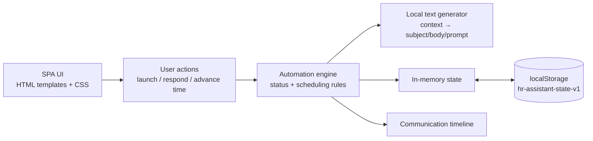
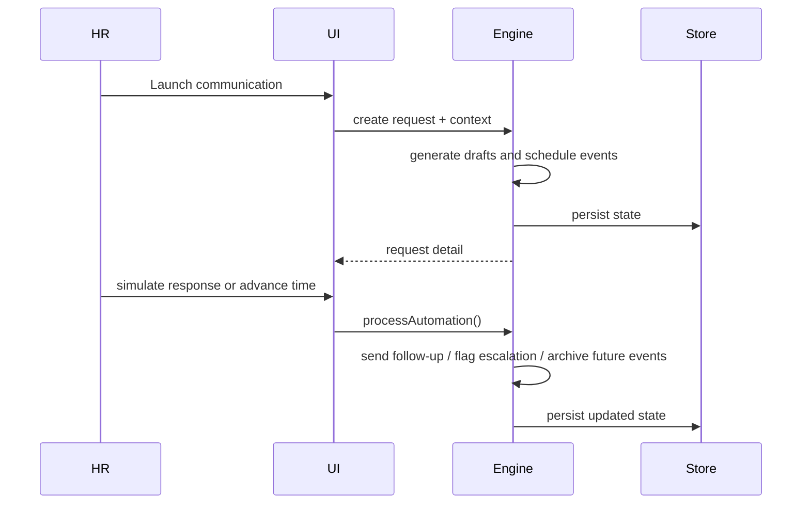

# Architecture

Humanly — статическое frontend-only приложение. Оно запускается открытием `index.html`, а весь state engine работает в браузере.

## Components

- `index.html` — shell приложения: sidebar, header, content root, modal и toast layers.
- `styles.css` — responsive visual system: cards, status badges, timeline, forms and modal states.
- `app.js` — state, seed data, rendering, local text generation, scheduling, response simulation, persistence and `.ics` export.
- `docs/` — product, architecture, data model, decisions, demo and pitch materials.

## State and storage

Состояние хранится в одном versioned объекте `hr-assistant-state-v2`. При первом запуске оно seed-ится synthetic data. Перезагрузка страницы сохраняет сотрудников, запросы, drafts, events, responses, settings и demo time.

## Automation engine

### Scheduling

`scheduleAt()` сохраняет исходное время и переносит событие на следующий подходящий рабочий слот, если оно попало на выходной, тихое время или за пределы рабочего дня. Причина сохраняется на event и отображается в Timeline.

### Text generation

Генератор получает employee context, purpose, deadline, tone, priority и history snapshot. Он возвращает структурированные `EmailDraft` с `subject`, `body`, `status` и prompt preview. Это deterministic demo provider; позже его можно заменить adapter-ом реального LLM.

## Runtime / deployment model

Runtime — современный браузер с включённым JavaScript. Deployment — static hosting или локальный файл. Внешние API и network calls не обязательны.
