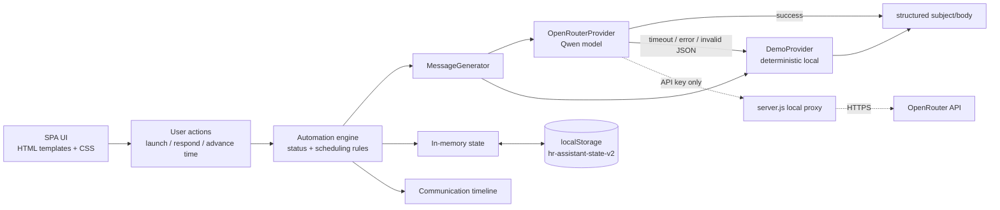
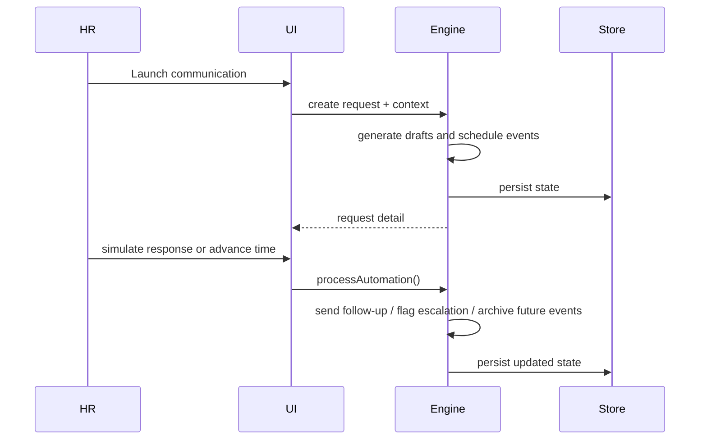

# Architecture

Humanly — static-first приложение с optional local proxy. Оно запускается открытием `index.html` без сети, а при запуске через `node server.js` получает безопасный путь к OpenRouter без раскрытия API key во frontend.

## Components

- `index.html` — shell приложения: sidebar, header, content root, modal и toast layers.
- `styles.css` — responsive visual system: cards, status badges, timeline, forms and modal states.
- `app.js` — state, seed data, rendering, `MessageGenerator`, `OpenRouterProvider` client adapter, `DemoProvider`, scheduling, response simulation, persistence and `.ics` export.
- `server.js` — minimal Node.js local proxy. Reads `OPENROUTER_API_KEY` and `OPENROUTER_MODEL` from ignored `.env`, validates structured output and never returns the key to the browser.
- `prompts/hr-message-system.txt` — editable system prompt for Live AI.
- `docs/` — product, architecture, data model, decisions, demo and pitch materials.

## State and storage

Состояние хранится в одном versioned объекте `hr-assistant-state-v2`. При первом запуске оно seed-ится synthetic data. Перезагрузка страницы сохраняет сотрудников, запросы, drafts, events, responses, settings и demo time.

## Automation engine

### Scheduling

`scheduleAt()` сохраняет исходное время и переносит событие на следующий подходящий рабочий слот, если оно попало на выходной, тихое время или за пределы рабочего дня. Причина сохраняется на event и отображается в Timeline.

### Text generation

`MessageGenerator` получает только минимальный employee context, релевантную history, purpose, deadline, urgency, tone и state предыдущих сообщений. `OpenRouterProvider` отправляет этот context локальному proxy и ожидает JSON `{ subject, body, tone, tags }`. При missing key, недоступном proxy, timeout около 8 секунд, network error, invalid JSON или schema mismatch используется `DemoProvider` без изменения UX.

Follow-up генерируется перед отправкой и получает предыдущий отправленный текст как контекст. Поэтому Live AI может продолжить разговор, не повторяя первое письмо.

Главное решение: **Live AI is an enhancement, not a runtime dependency.**

## Runtime / deployment model

Runtime — современный браузер с включённым JavaScript. Offline deployment — локальный файл или static hosting. Live deployment для development/demo — `node server.js` + ignored `.env`; production-следующий шаг — server-side auth, audit trail, permissions и provider adapters.
