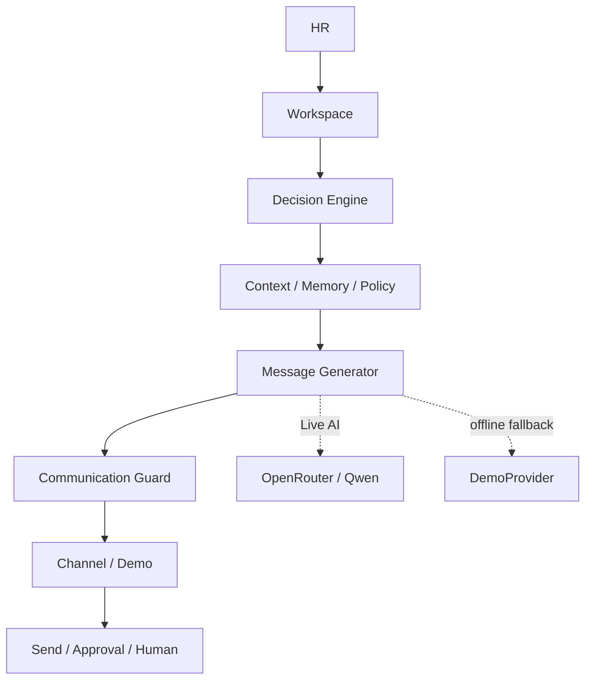
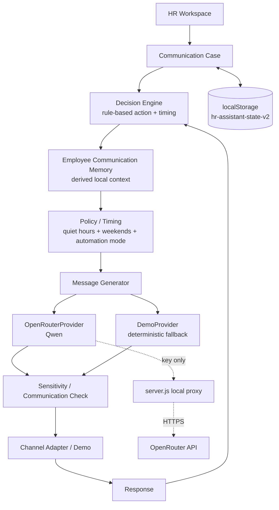

# Architecture

ХьюманЛИ — static-first/local-first workspace с optional local proxy для Live AI. UI и domain state остаются в браузере; LLM отвечает только за wording, а решение о действии принимает deterministic Decision Engine.

## Jury view · схема, читаемая за 10 секунд

Это версия для Slide 6. Она показывает границы MVP и не перегружает жюри внутренними деталями.

Как проговаривать: «Workspace даёт контекст, Decision Engine выбирает действие, Message Generator отвечает за язык, Guard проверяет уместность, а результатом становится отправка, подтверждение или передача человеку. Live AI можно заменить на DemoProvider без изменения workflow».

## Engineering view

## Components

- `index.html` — ХьюманЛИ shell: brand, navigation, header, modal and toast layers.
- `styles.css` — visual system for inbox, decision cards, memory, campaigns and analytics.
- `app.js` — state, seed data, Inbox, Decision Engine, Memory, guard, policies, Campaigns, Analytics, scheduling, generators, response simulation and persistence.
- `server.js` — minimal Node proxy. Reads `OPENROUTER_API_KEY` and `OPENROUTER_MODEL` from ignored `.env`; validates `{subject,body,tone,tags}` and never returns the key.
- `prompts/hr-message-system.txt` — separate system prompt for Live AI.

## Core separation

`Decision Engine` возвращает `action`, `channel`, `sendAt`, `tone`, `priority`, `escalation`, `reasonCodes` и `humanExplanation` до генерации текста. Он не вызывает LLM.

`MessageGenerator` получает decision + minimal employee/request/history/memory context. `OpenRouterProvider` отвечает за естественный русский текст; `DemoProvider` сохраняет offline-ready flow при missing key, network/API error, timeout или invalid JSON.

`Communication Check` — deterministic/hybrid guard перед отправкой. Он не подменяет policy: sensitive topics и режимы review/recommendation управляются отдельно.

## State and migration

Состояние хранится в `hr-assistant-state-v2`: employees, requests, drafts, events, responses, settings и campaigns. Новые поля (`campaigns`, `automationPolicy`, request decision/policy metadata) добавляются через безопасные defaults при загрузке старого state.

## Automation policy

- `autopilot`: обычные действия выполняются автоматически;
- `review`: decision и draft готовы, но due action ждёт подтверждения HR;
- `recommendation`: система только показывает следующий шаг и ничего не отправляет автоматически.

Sensitive topics (`performance`, увольнение, компенсация, конфликт, дисциплина) требуют подтверждения HR независимо от обычного autopilot.

## Runtime / scaling

Offline deployment — открыть `index.html` или использовать static hosting. Live demo — `node server.js` + ignored `.env`. Следующий production-слой: API/DB вместо localStorage, authentication/RBAC, server-side audit trail, real delivery adapters, consent/opt-out и observability.
